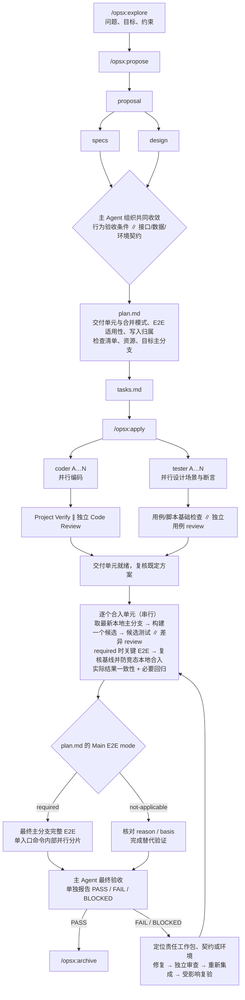

# agentic 工作流

本 schema 使用中文说明和英文结构，适用于以工作包组织的并发开发。
项目通过兼容引擎配置 `openspec/config.yaml` 的 `schema: agentic` 选用它。
工作流源码位于 `assets/openspec/schemas/agentic/`，安装时复制到目标项目的 `openspec/schemas/agentic/`；
运行目录、`.openspec.yaml` 和 `/opsx:*` 保留上游兼容名称，规划、状态和校验统一通过 `npx --quiet --no-install openspec` CLI 调用底层引擎。

## 规则权威

同一条规则只在一处定义，其余文件引用它。本 README 不被任何执行者读取，只做结构解释、文件索引和移植说明：
可以放解释性汇总（如检查总览），但不得在此定义新规则，也不作为规则来源；冲突时以 schema 与 roles 为准。

| 优先级 | 文件 | 运行期读者 | 运行期投递 | 定义什么 | 不得包含 |
| --- | --- | --- | --- | --- | --- |
| 1 | [schema.yaml](schema.yaml) | 主 Agent（`npx --quiet --no-install openspec instructions`） | artifact/apply `instruction`；**`all_done` 后不下发** | 依赖图、产物生成要求、apply 调度顺序与门禁判据、模型解析契约正文 | 角色内部操作细节 |
| 2 | [roles/](roles/) | 各子 Agent（全文显式传入） | 由主 Agent 作为调用输入传入，引擎不注入 | 该角色的输入、边界、执行步骤和报告格式 | 其他角色职责、项目级配置 |
| 3 | [templates/](templates/) | 主 Agent（同一次 instructions 调用） | 同一次 instructions 的 `template` 字段 | 产物骨架、字段填写来源和格式示例 | 规则正文 |
| 4 | [procedures/acceptance.md](procedures/acceptance.md) | 主 Agent（最终验收） | 由 skill 或等效入口完整读取 | 验收目标、审计组、判定和记录 | 流程调度 |
| 5 | [openspec/config.yaml](../../config.yaml) | 主 Agent（注入 instructions） | 每次 instructions 都注入 `context` 与 `operationGuidance`；**`all_done` 后仍注入**；同项目其他 schema 的变更也会收到同一份文本，故 agentic 规则须带适用前缀 | 稳定项目画像、项目级补充项与优先级说明、`all_done` 后的验收兜底、归档规则（schema 无 archive 段） | 单次变更状态、未经核实的项目事实、除 `all_done` 兜底外的 schema 门禁正文 |
| 6 | 本 README | 维护者、使用者 | 不投递（仅人读） | 结构解释、文件索引、移植清单、验证入口 | 任何新规则 |

投递保证决定规则落点，不只是文风问题：

- `all_done` 之后引擎只下发归档提示（实测：apply `instruction` 在 `all_done` 时被替换为一段 127 字符的归档提示），
  而 `context` 与 `operationGuidance` 照常注入。因此「验收在 apply 内执行」「`all_done` 不等于验收」
  「保留 CLI 原始状态并单独报告 PASS/FAIL/BLOCKED」这类必须在该时刻可见的规则，除 AGENTS.md 的宿主级
  路由外，还要由 config.yaml 的 `operations.apply.guidance` 承接（`context` 只保留指向，不复述门禁正文）
  ——这是该文件重复 schema 门禁的唯一例外。
- 反向的规则（模型解析契约）只写在 schema.yaml 的 apply instruction：它在派发角色时必然下发，
  且 `all_done` 后不再需要，config 侧重复没有投递理由。

同一规则同时出现在多处时，按 `schema.yaml` instruction > `openspec/config.yaml` context/guidance > 本 README 裁决。
roles 与 procedures 不参与该顺序：它们自足定义各自读者范围内的行为，子 Agent 只收到对应文件。

artifact instruction 放生成要求、依赖语义与校验判据；字段填写来源和格式示例放在同一次 instructions
下发的 template 注释中，同一句话不两处维护。

以下章节是索引，不定义规则，其中的流程与判据以 schema 与 roles 为准：
Detailed Workflow、Operating Model、Check Levels。

## Flow

整体流程分为 **explore → propose → apply → archive** 四个阶段，对应宿主 Agent 的 `/opsx:*` 入口。
这些入口不是 schema.yaml 中注册的 operation，也不是可直接执行的终端命令：宿主提供入口，
CLI 提供 schema 解析、状态和 instructions，宿主读取这些输入后执行具体工作。
propose 增加并发执行计划，apply 增加并发编码、独立代码审查、校验及 E2E 测试（项目开关开启时为强制），
并要求宿主主 Agent 在 apply 结束前完成最终验收；这些是宿主的流程义务，不是 CLI 自动门禁。

| 阶段 | 宿主入口 | 主要职责 | 产出与下一阶段条件 |
| --- | --- | --- | --- |
| explore | `/opsx:explore` | 调研现状、讨论方案、澄清问题和范围；不承担产品编码、交付或最终验收 | 形成可用于提案的问题、目标与约束 |
| propose | `/opsx:propose` | proposal 记录动机与范围；specs/design 可并行，生成 plan.md 前由主 Agent 组织共同收敛；plan.md 确定交付单元、合并模式、E2E 适用性与覆盖；tasks 转为可跟踪任务 | proposal、specs、design、plan.md、tasks.md 就绪；有效 skip_specs 可跳过增量规范 |
| apply | `/opsx:apply` | 按计划并发编码与测试设计、分支交付、独立审查、集成及主分支验收；主 Agent 必须执行最终验收 | 实际交付和完整证据；最终验收 PASS 后具备归档条件 |
| archive | `/opsx:archive` | 核对验收仍有效，确认目标版本未变；规范同步与变更移动由归档操作执行 | 本次变更及其规划、执行证据可追溯 |

阶段名称、依赖图、apply 调度、合并与 E2E 门禁的规则正文见 [schema.yaml](schema.yaml) 的 artifact instruction 与
apply instruction；角色职责见 [roles/](roles/)。openspec/config.yaml 的 context 提供共享补充，
operation guidance 提供对应操作的附加指导；二者不创建新阶段或命令。

config 的 `context` 按 Repository Structure、Standard Commands、Engineering Constraints 和
Runtime Environment 维护稳定项目画像。安装模板中的“未配置”是待适配状态，不是可猜测的默认值；
需要时由 environment/recon 隔离采集客观事实，主 Agent 确认后更新。单次变更的范围、提交、工作包、
临时资源及执行证据分别属于 plan.md、tasks.md 和 verification.md，不写入全局 context。

可跳过增量规范的唯一例外是 `skip_specs`：仅适用于规范层面行为不变（纯重构、工具或文档变更）的变更，
写在 CLI 返回的 `changeDir` 下的 `.openspec.yaml`：

```yaml
schema: agentic
skip_specs: true
```

这是变更元数据的最小示例；已有文件保留其他字段。随后运行 `npx --quiet --no-install openspec status --change <name> --json`
确认 specs 状态为 `skipped`。计划记录跳过理由及既有行为契约的路径/版本；schema.yaml 的 plan instruction
中所称“依据 specs”在此情况下指这些契约。

## Detailed Workflow



`∥` 表示可针对同一代码版本并行执行。图展示成功路径；失败按 schema 与角色规则回到相应检查节点。
各交付单元基于最新主分支验证；required 时每个候选执行关键 E2E，全部合入后执行最终完整 E2E。
not-applicable 时完成计划中的替代验证，`verification.md` 在整个执行过程持续更新。

## Operating Model

`plan.md` 定义工作包、资源、交付单元和检查策略，`tasks.md` 跟踪进度，`verification.md` 连续记录实际证据。
契约明确后，coder 与 tester 可并行；每个交付单元在最新主分支上构造候选，完成适用 Verify、独立 review 和
关键 E2E 后合入本地主分支，再完成主分支检查。执行 apply 已授权此本地合入，无须逐单元人工批准；
远端推送单独要求明确授权，默认不执行；明确要求远端交付时也先完成本地合入及检查。
最终主分支 E2E 与最终验收的具体判据以 schema、roles 和 acceptance 为准。

工作包、交付单元与运行资源的规则正文在 `schema.yaml` 的 plan instruction，字段与填写方式在
`templates/plan.md`，角色职责在 `roles/`；本 README 不重复这些运行期规则。

### E2E Switch

项目级 E2E 校验开关位于项目 `openspec/config.yaml` 的 `x-agentic.e2e`，由 agentic 扩展解析；
未配置时按 `enabled: true` 处理，因此老项目升级后不会静默跳过 E2E。

```yaml
x-agentic:
  e2e:
    enabled: true        # 缺省开启：每次变更的 Main E2E mode 必须为 required
    command: ""          # 可选：项目真实 E2E 命令或入口
    maxAttempts: 3       # 同一变更连续失败的 E2E 重试上限；达到后停止自动重跑，须用户介入
```

`maxAttempts`（默认 3）限制“E2E 失败 → 修复 → 重跑”的循环：同一变更连续失败达到该值后，
`e2e run` 拒绝再开自动尝试、`e2e check` 判 `BLOCKED`，须由用户决定提高上限或调整方案；
候选与最终阶段的失败尝试共同计入，人工记录不执行命令、不计入该上限。

```powershell
npx --quiet --no-install openspec-agentic e2e --json              # 读取开关本身，每次从磁盘读，不缓存
npx --quiet --no-install openspec-agentic e2e run --change <变更>  # 在流程内执行项目 E2E 并写执行记录
npx --quiet --no-install openspec-agentic e2e check --change <变更>  # 比对开关、计划判据与执行记录
```

`e2e run` 是 **apply 阶段的 E2E 任务**入口：执行 `x-agentic.e2e.command`（可用 `--command` 覆盖；
`--stage candidate|final` 标注候选/最终阶段；人工场景用 `--manual --by --evidence [--result pass|fail|blocked] [--cases <范围>]`；
测试 worktree 用 `--planning-root <权威规划根>` 把记录写回权威变更目录），输出实时透传，
退出码 `0` 通过 / `1` E2E 失败 / `2` 无法执行（缺命令、缺变更、参数不完整、执行前产品代码脏，或已达 `maxAttempts` 连续失败上限）；
无论结果都在变更目录下写一条机器记录（`openspec/changes/<变更>/e2e/run-*.json`），随变更归档。
执行前若变更目录之外有未提交改动，直接拒绝执行；执行时产品已脏的记录也判失效。
人工记录用 `--result` / `--cases` 留证，且不参与自动重试失败计数。

`e2e check` 是最终 E2E 门禁行的完成条件：PASS 才勾选该行，非 PASS 时该行由扩展回退或保持待办，由“未完成任务阻断验收”的规则
在 apply 内拦下；它同时用于 apply 内的最终验收。执行者（tester）的执行任务交付不以该检查 PASS 为条件：
返回运行结果与原始证据后由主 Agent 汇总，再运行本检查。用户只要求只读核查时用 `--no-write`，不回写任何任务行。
只对已完成（其余任务全部勾选，仅扩展拥有的该行
与正在执行的最终验收行可待办）的 agentic 变更判定。两种 mode 都保留该行：`required` 时它是最终主分支
完整 E2E 的门禁检查行；`not-applicable` 时它只确认“不适用判据已按计划固化”，实际替代验证另列为主 Agent
拥有的任务（未完成时检查判 BLOCKED，不会被误勾）。
结论为 `PASS / FAIL / BLOCKED`；进行中的变更记为 `IN_PROGRESS`，非 agentic 变更记为 `SKIPPED`，两者都不阻断。
`required` 的变更还须有成功执行记录：无记录、只有人工记录而项目已配置命令、记录命令与配置不一致、
最近一次相关尝试失败、或只有候选阶段记录、或记录停在旧提交后代码又有改动、或执行时产品代码已脏，均判 FAIL。
`enabled` 为 true 或缺省时，变更只在用户显式批准降级、且 `plan.md` 的 `downgrade_approval`
留下可追溯记录时才可判 `not-applicable`；`enabled: false` 时按计划判据自行选择。
判据正文在 [schema.yaml](schema.yaml) 的 plan/tasks/apply instruction，验收核对在
[procedures/acceptance.md](procedures/acceptance.md)；本节只是人类可读速查，不新增规则。
两条命令只读配置、`plan.md` 与执行记录，不解析 `verification.md` 的散文内容，也不会阻止归档：
它们可在流程内或 CI 中调用，但不是不可绕过的门禁（见 [Enforcement Boundary](#enforcement-boundary)）。

#### E2E 并行执行（单入口）

最终 Main E2E 的并行只发生在**项目 E2E 命令内部**，流程层面对外仍是一个入口：

```powershell
# 每轮只调用一次；分片并行由 x-agentic.e2e.command 内部完成
npx --quiet --no-install openspec-agentic e2e run --change <变更> --stage final
```

- `x-agentic.e2e.command` 指向项目自己的聚合入口（如 `node scripts/e2e-parallel.mjs`），由它在内部并发分片、
  汇总退出码：任一分片失败或约定用例零执行即非零退出；各分片写独立报告。
- **不得**按分片多次调用 `e2e run --stage final`：`e2e check` 只认最近一条 final 记录，多个 final 记录会让
  失败分片被后完成的通过分片掩盖；这也与“记录命令须与 `x-agentic.e2e.command` 一致”的门禁冲突。
- 候选关键 E2E 用 `--stage candidate`，可按交付单元/分片分别留证，由主 Agent 汇总，不受最终门限制。
- 分片资源必须隔离（数据库/schema、端口、账号、可写目录、外部服务），无法隔离时串行或按独占队列排队；
  分片数不超过可用隔离资源。
- `verification.md` 的 `Main E2E` 节按唯一 E2E ID 核对各分片覆盖、固定版本与隔离证据，分片报告路径逐项引用。

规则正文在 [schema.yaml](schema.yaml) 的 plan/apply instruction，本节只是人类可读速查。

### Role Models

7 个角色的模型只在项目 `openspec/config.yaml` 的 `x-agentic.roles` 中配置。agentic 扩展不维护宿主列表，
也不转换或校验模型目录；模型标识符原样交给当前 Agent 宿主解释。

```yaml
x-agentic:
  roles:
    main: "@current"
    coder: provider/fast-model
    reviewer: { model: provider/review-model }
```

键为 `main`、`coder`、`integrator`、`tester`、`validator`、`reviewer`、`environment`；
值可以直接写非空模型字符串，也可以写 `{ model: <模型> }`。安装时 7 个角色都初始化为
`@current`；这是扩展保留值，表示继承主会话当前实际模型，不是交给宿主解析的模型名。
`x-agentic.roles` 是 agentic 扩展的项目级配置，由 `npx --quiet --no-install openspec-agentic roles` 解析；角色文件和产物模板不定义模型。

| 命令 | 作用 |
| --- | --- |
| `npx --quiet --no-install openspec-agentic roles [--json]` | 每次从磁盘重新读取并校验 7 个角色的当前模型映射 |
| `npx --quiet --no-install openspec-agentic roles --strict` | 额外要求 7 个角色全部显式配置 |
| `npx --quiet --no-install openspec-agentic roles set\|unset <角色> [模型]` | 直接维护 `openspec/config.yaml` 的 `x-agentic.roles` |
| `npx --quiet --no-install openspec-agentic doctor` | 安装完整性、引擎版本、schema 与角色配置校验 |

```powershell
npx --quiet --no-install openspec-agentic roles set coder provider/fast-model
npx --quiet --no-install openspec-agentic roles unset coder
```

`openspec config` 的其他键（`profile`、`workflows` 等）仍由引擎管理**全局配置**；
`x-agentic.roles` 由 agentic 扩展接管并写入项目配置。

模型解析契约的权威正文在 [schema.yaml](schema.yaml) 的 apply instruction；本节只是人类可读速查，不新增规则：
入口为 `npx --quiet --no-install openspec-agentic roles --json`（每次派发前重读，不缓存），`@current` 表示继承
主会话当前实际模型，其他值原样传给宿主当次调用的原生模型参数；宿主不支持本次调用选模时须报告能力限制，
不得生成宿主专用 agent 定义。修改 config 后，其他角色下次启用时生效，main 在下次启动或宿主原生切换时生效。

### Check Levels

| 检查 | 时机 | 关注内容 | 复用边界 |
| --- | --- | --- | --- |
| Local Checks | 编码期间 | 对当前改动做快速反馈 | 不能替代交付清单 |
| Project Verify | 分支交付、适用的集成阶段、合并候选及主分支 | 构建、静态/类型检查、单元和集成测试；不含 E2E | 需核对代码内容、命令/配置、环境和范围 |
| Code Review | 各分支交付与适用的集成/合并阶段 | 非作者检查实际 diff，关注正确性、边界、安全及回归 | 无新增差异时记录依据并沿用结论 |
| Candidate E2E | required（项目开关开启或缺省时为强制）时每个候选合入前 | 对应交付单元的关键路径与跨组件行为 | 不能替代最终完整覆盖 |
| Main E2E | required（同上）时全部单元合入后的最终主分支每轮执行一次 | 从真实入口验证关键用户路径及跨组件行为 | 仅计划明确时增加中间 Main E2E |
| Final Verification | apply 中其他适用任务完成后由主 Agent 执行；也可通过 `/opsx:verify` 手动核查 | 核对需求、设计、计划、任务、实现和证据的一致性 | 不替代实际测试、独立检视或 E2E |

检查清单、角色隔离与证据复用条件见 schema.yaml 的 plan instruction；候选与主分支的
执行及失败处理见 apply instruction，验收判读见 procedures/acceptance.md。

`schema.yaml`、`templates/` 与 `roles/` 正文中的“实现 Agent”“集成 Agent”“测试 Agent”“验证 Agent”
分别指 `coder`、`integrator`、`tester`、`validator`；指向写入目标时用文件名（`plan.md`、`tasks.md`），
描述依赖关系时用产物名（plan、tasks）。

## Documents

### Workflow Files

路径以本 README 所在目录为基准。各文件的运行期读者与优先级见上文「规则权威」；
修改通用流程时从这里定位；某次变更的需求、计划或执行结果写入下面的变更产物，不通过修改通用模板记录。

| 文件 | 实际职责 | 要调整什么行为时修改 |
| --- | --- | --- |
| [schema.yaml](schema.yaml) | artifacts 的生成路径、模板、依赖及 instruction；apply.requires、tracked 文件和 apply 调度指令 | 依赖图、artifact 生成要求、apply 调度和交付门禁 |
| [templates/](templates/) | proposal、spec、design、plan、tasks、verification 的产物结构 | 对应产物的字段与填写方式 |
| [roles/](roles/) | reviewer、coder、validator、tester、integrator、environment 的输入、边界、程序和报告要求 | 对应角色的执行行为 |
| [procedures/acceptance.md](procedures/acceptance.md) | 最终验收的目标核对、证据审计、任务例外及判定程序 | 最终 PASS/FAIL/BLOCKED 的判定和记录规则 |
| [openspec/config.yaml](../../config.yaml) | 项目唯一配置：默认 schema 选择、context 共享补充、`operations.guidance`、角色模型 `x-agentic.roles` 与项目级 E2E 开关 `x-agentic.e2e` | 项目级补充项与优先级说明；扩展不保留第二套配置；角色模型由 `npx --quiet --no-install openspec-agentic roles` 解析，E2E 开关由 `npx --quiet --no-install openspec-agentic e2e` 解析；归档规则只能写入 `operations.archive.guidance`（schema 级 `archive` 段可通过校验但不随 instructions 下发） |
| [agentic-verify/SKILL.md](../../../.agents/skills/agentic-verify/SKILL.md) | 解析变更和 schema，定位并读取最终验收程序 | 验收入口如何取得上下文及加载指令 |
| [AGENTS.md](../../../AGENTS.md) | 将 agentic 最终验收、手动 verify 和归档前检查路由到项目 skill | 宿主何时必须进入专用验收入口 |
| [tests/agentic-workflow.ps1](tests/agentic-workflow.ps1) | 在临时样例中检查 CLI 依赖、状态和指导输入 | CLI 兼容性及流程配置回归检查 |
| [tests/scenarios.md](tests/scenarios.md) | 宿主 Agent 行为的验证场景与预期 | 调度、隔离、证据判断等行为应如何验证 |
| [README.md](README.md) | 整体流程、职责、接入方式和执行边界说明 | 本文件；修改它不会自动改变 CLI 或角色指令 |

### Change Artifacts

规划目录与代码 worktree 分开定位。主 Agent 以 `npx --quiet --no-install openspec instructions ... --json` 返回的 `changeDir`
维护权威文档，以 `planningHome.root` 定位主规范目录 `<planningHome.root>/openspec/specs/`。
子 Agent 在各自 worktree 工作并返回提交及证据；其中即使存在规划文档副本，也不作为权威记录。
使用外部 store 时，后续 status、instructions 和归档保持同一 store 选择。

| 文件 | 职责 |
| --- | --- |
| proposal.md | 动机、范围、能力和影响 |
| specs/**/spec.md | 行为契约与可验证场景 |
| design.md | 技术方案、接口和决策 |
| plan.md | 工作包、协作依赖、合并与验证策略 |
| tasks.md | 执行步骤、检查和进度；主 Agent 统一维护 |
| verification.md | apply 期间的实际版本、验证结果、review 问题及复核证据 |

## Enforcement Boundary

可使用只读 `openspec-agentic workflow check --change <name> --stage plan|final|archive --json`
检查意图字段、需求覆盖引用、唯一门禁标记，并在 final/archive 核对目标提交、契约和证据摘要及 E2E。
字段与执行时序见 [workflow-check](procedures/workflow-check.md)，完整填写示例见
[minimal-change](procedures/minimal-change.md)。这不是对上游 archive 的自动拦截，也不证明语义验收。

### Host and CLI Responsibilities

agentic 扩展使用上游引擎的文档依赖和 prompt 指令，规划命令由项目本地 `npx --quiet --no-install openspec` 提供；不修改引擎的存储协议或宿主 Agent 的工具能力。
CLI 检测文档是否存在并统计任务复选框，不会自动启动 Agent、运行测试或判断报告真实性。

因此 artifact 显示 done、apply 显示 `all_done`、或普通 schema 校验成功，均不等于项目验收通过。
最终验收、独立审查和 E2E 都是宿主主 Agent 按 apply 必须调度和留证的流程义务，不是 CLI 内置钩子或不可绕过的门禁。
`e2e check` 仍只用 `[final-verification]` 定位允许待办的验收行；`workflow check` 额外要求它和
`[e2e-owned]` 各存在且唯一、不能共用一行。需要不可绕过的强制时仍须在受控入口或 CI 中调用。
归档 guidance 是提示层补充；若需要强制阻止未验收合并或归档，应另行实现 CI、分支保护或执行器检查，
不能声称本配置已提供这些能力。可选方案是在 CI 中执行可自动化的 Project Verify、候选 E2E 和证据完整性检查，
将其设为分支保护的必需状态检查；对最终 Main E2E 和人工/Agent 审查，用合并队列或合入后的受控流水线记录结果，
并以受保护的发布/归档入口拒绝缺少有效 PASS 证据的变更。

旧变更如果已存在 tasks.md，需在继续 apply 前补写 plan.md 和验收任务；apply 显式依赖全部规划 artifact。

工作流不预设各角色使用的具体模型：模型由 `openspec/config.yaml` 的 `x-agentic.roles` 配置（见 [Role Models](#role-models)），
未配置时使用宿主默认，模型差异不改变角色职责与独立性要求；
角色分配、验收与归档不新增远端推送、回滚或发布授权；apply 包含检查通过后的本地主分支合入。

### Portability

移植时按以下清单合入，保留目标项目已有配置、规则及其他 schema：

- 将源码 `assets/openspec/schemas/agentic/` 安装到目标 `openspec/schemas/agentic/`，并安装项目 `.agents/skills/agentic-verify/`；推荐使用 `npx @dongfanglin/openspec-agentic@latest init . --tools <宿主>`。
- 将本项目 AGENTS.md 的验收路由合入目标项目现有规则；非 AGENTS.md 宿主加入等效项目指令。
- 对照本项目 `openspec/config.yaml`，在目标项目兼容配置中选择 `schema: agentic`；已有变更仍须核对自身 schema。
- 将该配置的 `context` 合入目标项目已有 context，保留业务约束，不直接覆盖原文。
- 合入 `operations.apply.guidance` 和 `operations.archive.guidance`，保留目标项目已有指导、其他 operations、rules、store 等配置；逐项解决冲突，不整份覆盖 config.yaml。
- `openspec/config.yaml` 模板把 7 个角色全部初始化为 `@current`；按需覆盖个别角色模型。
- 用目标 CLI 检查 schema 解析结果及 instructions 中的 `context`、`operationGuidance`，确认 apply/archive 均收到指导；不要仅凭文件已复制判断接入完成。`npx --quiet --no-install openspec-agentic roles --json` 确认当前角色模型解析结果。

只复制 schema 不会自动安装或改写宿主的 `/opsx:verify`。

## Getting Started

### Prerequisites

CLI 必须支持本文使用的自定义 schema、`changeDir` / `planningHome`、`skip_specs` 和 `operations.*.guidance`。
版本号本身不足以证明这些能力，接入时须运行下文 CLI 回归检查。

宿主须能读取项目指令及模板、执行 Git/worktree 和项目检查命令、显式传入角色材料并汇总报告，
并能创建可按需隔离上下文的子 Agent（各角色的隔离要求见 schema.yaml 的 apply instruction 与 roles/）。
若使用角色模型覆盖，宿主还须能在本次创建、派发或切换调用中接受模型参数；不支持时明确报告能力限制。
真正并发取决于可用并发容量；串行实现仍须保留独立审查。
required E2E 还需可用的真实产品驱动、隔离运行资源，或计划明确的人工执行方案。
缺少某项能力时，依赖它的任务保持 BLOCKED。

### First Change

1. 按上面的移植清单接入 schema、配置、skill 和宿主指令，核对宿主已提供四阶段命令。
2. 在目标项目根目录运行 `npx --quiet --no-install openspec-agentic --version`、`npx --quiet --no-install openspec-agentic roles --json`、`npx --quiet --no-install openspec schema which agentic --json`、`npx --quiet --no-install openspec schema validate agentic --json`，确认实际 CLI 版本、角色模型解析结果和 schema 位置。
3. 在宿主 Agent 会话中发起首次变更，例如 `/opsx:explore 梳理新增导出功能的目标、约束和验收行为`、`/opsx:propose add-export`。
   向 propose 提供 explore 中已明确的需求，检查生成的规划、工作包和验证策略。
   宿主没有 propose 入口时，可先运行 `npx --quiet --no-install openspec new change add-export --schema agentic`，
   再由 Agent 按各 artifact 的 instructions 依赖顺序生成规划；创建目录本身不代表规划已完成。
4. 在终端核对 `npx --quiet --no-install openspec status --change add-export --json`、`npx --quiet --no-install openspec instructions apply --change add-export --json`
   和 `npx --quiet --no-install openspec instructions archive --change add-export --json`，确认 schema、权威目录、规划依赖、context
   和 operationGuidance 正确；随后在宿主中执行 `/opsx:apply add-export`。PASS 后按需要发起 `/opsx:archive add-export`。

## Validation

在项目根目录运行 `npx --quiet --no-install openspec schema validate agentic --json` 校验结构与 artifact 模板；
`npx --quiet --no-install openspec-agentic roles` 校验 `x-agentic.roles` 配置并始终读取磁盘中的当前值。
实际执行时检查 `npx --quiet --no-install openspec status --change <name> --json` 的阶段依赖，
并通过 `npx --quiet --no-install openspec instructions <artifact> --change <name> --json` 获取对应阶段内容。
这些命令用于检查流程配置，不替代目标项目的测试、代码检视或 E2E。

CLI 回归在临时目录验证依赖门槛、skip_specs、`all_done`、附加指导输入以及角色模型实时解析，不触碰实际变更：

```powershell
powershell -NoProfile -File assets/openspec/schemas/agentic/tests/agentic-workflow.ps1
```

通过记录与覆盖范围见 [tests/scenarios.md](tests/scenarios.md)；该表同时列出宿主 Agent 的行为验收场景。
CLI 回归通过不代表这些行为场景已实跑，也不代表目标项目的 verify、review 或 E2E 已执行。
